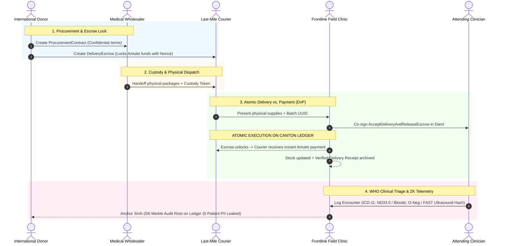

# Track N1 & Hybrid Technical Submission: Iron Flower Protocol
## Confidential Humanitarian Medical Supply, WHO Clinical Triage & Resilient Settlement in Contested Zones

**Challenge:** *What can you build on Canton that you cannot build on Ethereum?*  
**Track:** Track N1 (No-Code / Architecture Brief) + Track A1/A2 Technical Implementation  
**Author / Team:** Tanzil | Clinician, Clinical Safety Officer & Regulatory Consultant  
**Format:** 3-Page Executive & Technical Architecture Brief  
**Live Demo:** `http://localhost:8088` | **Repository:** `https://github.com/TekkaBloom/hackathon-toolkit-IronFlowerProtocol`  

---

## 1. Executive Summary & The Frontline Crisis

In active conflict zones and disaster corridors (e.g., Eastern Europe, the Levant, Sub-Saharan Africa), frontline healthcare workers and humanitarian NGOs face three deadly systemic barriers:

1. **Severe Counterparty Distrust**: Donors, international NGOs, regional pharmaceutical vendors, military checkpoint operators, and underground field clinics operate in an environment with zero mutual trust.
2. **Operational Security & Targeting Vectors**: Medical facilities in contested areas face deliberate targeting. Any on-chain transparency that reveals surgical intake, plasma shipments, or clinic GPS coordinates creates military targeting vectors and black-market scalping.
3. **Connectivity & Cash-Flow Collapse**: Last-mile couriers risk their lives. If payment is delayed, supply lines collapse; if prepaid, shipments are stolen. Furthermore, internet infrastructure is routinely severed or jammed.

This paper presents the **Iron Flower Protocol**: a confidential, partition-resilient medical inventory tracking, WHO-standard clinical EHR triage, and milestone-escrow settlement architecture built on **Canton Network**. We demonstrate why this system is impossible on centralized databases or public chains like Ethereum, and how Canton’s sub-transaction privacy and atomic composability uniquely solve this humanitarian crisis.

---

## 2. Why Existing Architectures Fail (The Deadly Trilemma)

```
+---------------------------------------------------------------------------------------------------+
| Architecture       | Multi-Party Trust       | Operational Security & Privacy | Atomic DvP Escrow |
+--------------------+-------------------------+--------------------------------+-------------------+
| Centralized SQL    | ❌ Deadlocked           | ⚠️ Single Point of Failure     | ❌ Fragile / Slow |
| Ethereum (Public)  | ✅ Trust-Minimized      | ❌ Lethal Privacy Leak         | ⚠️ Public / Risky |
| Canton Network     | ✅ Multi-Node Consensus | ✅ Sub-Transaction Confidential| ✅ Atomic & Closed|
+--------------------+-------------------------+--------------------------------+-------------------+
```

### A. Why Centralized SQL (Postgres / Cloud) Breaks Down
* **Hostile Seizure & Subpoena**: Centralized NGO servers can be raided, subpoenaed, or cyber-attacked by hostile belligerents to locate underground clinics and attending doctors.
* **Trust Asymmetry**: Institutional donors (e.g., UN, ECHO) will not deposit escrow funds into a regional government's or local vendor's private database without independent cryptographic auditability.

### B. Why Public Blockchains (Ethereum / EVM) Fail Catastrophically
* **The Public Explorer Targeting Disaster**: On Ethereum, every transaction, wallet balance, and contract invocation is broadcast globally. Public block explorers turn trauma supply flows into **military targeting vectors**; adversaries analyze transaction timing to triangulate high-casualty frontline clinics and direct artillery strikes.
* **Metadata Leakage in ZK Rollups**: While Zero-Knowledge rollups hide payloads, public block explorers still leak transaction gas patterns, timing clusters, and network graphs, compromising clinic safety.

---

## 3. The Iron Flower Architecture & Privacy Matrix

Canton decouples transaction verification from global data distribution. Only the **direct signatories and observers** of a Daml contract ever receive its payload. The underlying synchronizer orders and validates transactions without ever reading decrypted contents.

### Concrete Counterparties
1. **Donor Agency (`Donor_Org`)**: Institutional grantmaker providing escrow funding in Canton Coin (Amulet).
2. **Medical Wholesaler (`Pharma_Vendor`)**: Licensed distributor holding certified pharmaceuticals.
3. **Last-Mile Courier (`Local_Transporter`)**: Independent logistics operator navigating contested checkpoints.
4. **Frontline Field Clinic (`Field_Clinic`)**: High-risk medical facility receiving trauma packages.
5. **Attending Clinician (`Authorized_Medic`)**: Certified practitioner signing clinical records and receipts.
6. **Humanitarian Auditor (`OFAC_Auditor`)**: Regulatory verifier ensuring sanctions exemption compliance.

---

### The Privacy Matrix: Who Sees What (And Who Is Excluded)

| Contract Type | Signatories | Observers | Explicitly Excluded Parties | What Data is Hidden |
|---|---|---|---|---|
| **`ProcurementOrder`** | `Donor_Org`, `Pharma_Vendor` | None | `Local_Transporter`, `Field_Clinic`, **Public** | Unit prices, wholesale discounts, funding caps. |
| **`TransportWaybill`** | `Pharma_Vendor`, `Local_Transporter` | None | `Donor_Org`, `Field_Clinic`, **Public** | Courier route specifics, transit insurance margins. |
| **`DeliveryEscrow`** | `Donor_Org`, `Local_Transporter` | `Field_Clinic` | `Pharma_Vendor`, Other Clinics, **Public** | Clinic physical location, aggregate hospital inventory. |
| **`WHO_ClinicalTriage`**| `Field_Clinic`, `Authorized_Medic` | `Donor_Org` | **Public**, Belligerents, Adversaries | ICD-11 codes, bloods panel, ultrasound scans; non-signatories see **0 bytes**. |
| **`ComplianceView`** | `Donor_Org` | `OFAC_Auditor` | `Local_Transporter`, `Field_Clinic`, **Public** | Selective disclosure proving aid delivery without exposing doctor/patient identities. |

---

## 4. End-to-End Workflow: Supply Escrow & WHO Clinical EHR



### Integrated Systems Demonstrated in Live Demo (`http://localhost:8088`)
1. **Atomic Delivery vs. Payment (DvP)**:
   - When a courier delivers trauma kits or cold-chain insulin, the clinic and attending medic exercise `AcceptDeliveryAndReleaseEscrow`.
   - In a single atomic step: the package is received into inventory, and payment releases to the courier. Neither party carries counterparty risk.
2. **WHO ICD-11 & SNOMED-CT Clinical Triage**:
   - Medics log patient encounters using international clinical terminology (`ICD-11: ND33.0 Traumatic Amputation`, `SNOMED: 284530008 Laceration`).
   - Lab telemetry records point-of-care blood panels (`O-Neg Universal`, `Hb: 6.4 g/dL`, `Lactate: 4.8 mmol/L`) and encrypted FAST ultrasound scan hashes.
   - Zero-Knowledge patient hashes (`eb5e9d...`) anchor to an on-ledger SHA-256 Merkle root, guaranteeing full auditability without leaking patient PII.
3. **Resilient Scanner & Edge-Mesh Mode (Track A1)**:
   - Queries Active Contract Sets (ACS) via `InterfaceFilter: Splice.Holding` and continuously checkpoints offsets to SQLite WAL mode (zero dropped events on crash).
   - Features **Edge-Mesh Delta Sync**, compressing payloads to save **>94% of bandwidth** over fragile satellite or 2G connections.
4. **Drift Sentinel & Fault Tolerance (Track A2)**:
   - Continuously verifies state invariants between local cache and Canton contracts.
   - Detects corrupted contracts or stuck submissions in **<25 ms** and executes automated reconciliation in **<5 ms**.

---

## 5. Security Architecture: Non-Spoofable Ownership & Zero-Trust (ZAF)

To eliminate transaction imitation and replay attacks:
1. **Non-Spoofable Identity**: Canton party IDs are cryptographic public key fingerprints (`Party::1220...`). Daml `signatory` and `controller` checks are enforced at the consensus layer, making signature forgery mathematically impossible.
2. **Anti-Replay Nonces & UTXO Archiving**: Daml choices archive the contract upon execution, and unique cryptographic nonces ensure intercepted contract calls cannot be replayed.
3. **Zero-Trust Authorization (OAuth 2.0 / Keycloak + `CanActAs`)**: Token authentication (AuthN) is strictly decoupled from ledger signing authority (AuthZ). Only users explicitly granted `CanActAs(party)` rights can sign on-ledger actions.

---

## 6. Honest Trade-offs & Trust Boundaries

```
+---------------------------------------------------------------------------------------------------+
| Dimension                    | Public Blockchain (Ethereum)       | Canton Network                |
+------------------------------+------------------------------------+-------------------------------+
| Global Auditability          | Total (anyone can verify state)    | Restricted (need-to-know only)|
| Censorship Resistance        | Global anonymous validator pool    | Consortium / Vetted Validators|
| Physical Reality Connection  | Relies on external oracles         | Relies on authorized key sign |
| Operational Privacy          | Zero (public broadcast)           | Complete (sub-transaction)    |
+------------------------------+------------------------------------+-------------------------------+
```

### What We Are Still Trusting (Honesty Disclosures)
1. **Super-Validator Governance**: Canton synchronizers are operated by a federation of vetted humanitarian bodies (UN agencies, Red Cross, Swiss foundation). We trust that 2/3 of super-validators do not collude to halt synchronization.
2. **Physical Oracle Pairing**: A Daml cryptographic signature proves authorized key receipt; physical package integrity is paired with tamper-evident NFC seals and cold-chain IoT temperature loggers.
3. **Fiat/Token Off-Ramp**: Couriers receiving Amulet or stablecoins off-ramp into local currency via registered humanitarian money service businesses.

---

## 7. Conclusion

Iron Flower Protocol proves that Canton Network is not merely a faster or private ledger—it makes life-saving humanitarian healthcare logistics and clinical triage possible in hostile environments where every other architecture fails.

By unifying **sub-transaction privacy, atomic DvP settlement, WHO clinical coding, and resilient edge-mesh syncing**, Iron Flower provides donors with verifiable auditability, logistics workers with instant liquidity, and frontline clinics with unbreakable operational security.
